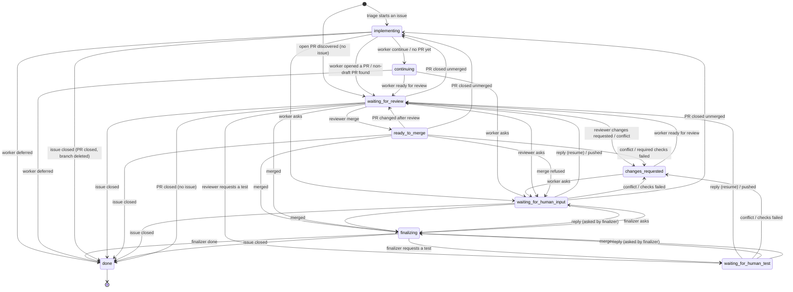

# Architecture: task state machine

This document is the specification of how a ghwatch task moves between states. It is the
reference for checking the code against, and for reasoning about the state machine itself.

**Status:** this is the target agreed on 2026-10-07. The code does not implement all of it
yet; [Differences from the current code](#differences-from-the-current-code) lists what is
still missing. When code and document disagree, decide which is wrong and fix one of them.

## Principles

- **One place decides transitions.** Actions (worker, reviewer, finalizer) return a
  decision; only the state machine changes `task.state`. Every combination of state and
  event below has a defined outcome.
- **Agents run when their basis changes, not when time passes.** Each decision records
  what it was based on (PR head, checks, comments, human replies). An agent runs again
  only when that basis has changed, or when a retry after a failure is due. The poll
  timer exists to look at GitHub, which is cheap, not to rerun agents.
- **Leaving a state cleans up after it.** Leaving a human wait always clears its marker,
  conversation and resume state, whatever the reason for leaving.
- **Every decision and transition is logged.**

## States

| State | Meaning | What runs |
| --- | --- | --- |
| `implementing` | Started from an issue; no PR yet | worker |
| `continuing` | The worker is continuing its work | worker |
| `changes_requested` | Reworking after review, a conflict or failed checks | worker |
| `waiting_for_review` | Waiting for review | reviewer (and deep reviewer) |
| `ready_to_merge` | Approved; waiting for checks and the merge | merge step |
| `waiting_for_human_input` | Waiting for a person's reply | nothing |
| `waiting_for_human_test` | Waiting for a person's test result | nothing |
| `finalizing` | Merged; finishing the issue | finalizer |
| `done` | Finished | nothing |

"Worker states" are `implementing`, `continuing` and `changes_requested`. A human wait is
"from work" when the worker or reviewer asked (resume state is a worker or review state),
and "from the finalizer" when the finalizer asked (resume state is `finalizing`).

## Diagram

The diagram shows the main paths. The tables below are complete and take precedence.

## Transitions from action results

**Creation**

| Event | New task state |
| --- | --- |
| Triage starts an issue | `implementing` |
| An open PR without a task is discovered (`review_all_open_prs`) | `waiting_for_review` (task without an issue) |

**Worker** (from worker states)

| Result | Next state |
| --- | --- |
| `waiting_for_review` / `waiting_for_human_test` | `waiting_for_review` (a test request is handed to the reviewer) |
| `waiting_for_human_input` | `waiting_for_human_input`, resuming the current state |
| `continue` | `continuing` |
| `done` | `finalizing` if the PR is merged, otherwise `waiting_for_review` |
| `deferred` | `done`; the issue's assessment becomes `deferred` |
| No PR found | `continuing` |
| Failure | Fallback model; otherwise same state, retried after `retry_after` |

**Reviewer** (from `waiting_for_review`)

| Result | Next state |
| --- | --- |
| PR is behind its base | Branch updated; same state, reviewed again immediately against the new head |
| `deep_review` | The deep reviewer runs in the same step |
| `merge` | `ready_to_merge` (with `auto_merge` off, it waits there for a person to merge) |
| `changes_requested` | `changes_requested` |
| `waiting_for_human_input` / `waiting_for_human_test` | Human wait, resuming `waiting_for_review` |
| `comment` | `waiting_for_review` |
| `retry` | Same state, retried after `retry_after` |
| The PR changed during review | Same state, retried after `retry_after` |
| Failure | Fallback model; otherwise retried after `retry_after` |

After any review result, the same basis (head, comments, checks) is not reviewed again.
Reviewers judge the change without waiting for CI; merging waits for required checks.

**Merge step** (from `ready_to_merge`)

| Condition | Next state |
| --- | --- |
| The PR changed after the review | `waiting_for_review` |
| Checks still running | Same state; checked again on the next poll |
| `auto_merge` off | Same state until a person merges |
| GitHub refuses the merge for a reason other than checks | `waiting_for_human_input` on the PR with the reason, mentioning the maintainers |
| Merged | `finalizing` (`done` for a task without an issue) |

**Finalizer** (from `finalizing`)

| Result | Next state |
| --- | --- |
| The PR is not merged | `waiting_for_review` if a PR exists, otherwise `continuing` |
| `done` | `done` (closes the issue or comments on it) |
| `waiting_for_human_input` / `waiting_for_human_test` | Human wait, resuming `finalizing` |
| `retry` | Same state, retried after `retry_after` |

## Reactions to outside events

Evaluated on every poll, in the row order below; the first row that applies wins.
"Wait (work)" and "Wait (finalizer)" are the two kinds of human wait.

| Event | Worker states | `waiting_for_review` | `ready_to_merge` | Wait (work) | Wait (finalizer) | `finalizing` |
| --- | --- | --- | --- | --- | --- | --- |
| Issue closed by someone | Close the PR with a comment, delete the branch and worktrees, `done` | same | same | same | `done` | `done` |
| PR found | `waiting_for_review` (draft: record its number only) | — | — | Record its number | — | — |
| PR not found | — | `continuing` | `continuing` | `continuing` | — | `continuing` |
| PR merged | `finalizing` | `finalizing` | `finalizing` | `finalizing` | No change | No change |
| PR closed unmerged | `implementing` (no issue: `done`) | same | same | same | — | — |
| Conflict with base | Run the worker now | `changes_requested` | `changes_requested` | `changes_requested` | — | — |
| Required checks failed | Run the worker now | Reviewer judges | `changes_requested`, once per head | `changes_requested`, once per head | — | — |
| Someone pushed (head changed) | Run the worker now | Review again | `waiting_for_review` | `waiting_for_review` | — | — |
| New human comment | Run the worker now (do not skip to review) | Review again | `waiting_for_review` | Resume, if after the question, on the PR or the issue | Resume, same rule | — |
| Time passes | Rerun when the scheduled retry is due | Nothing (no review until the basis changes) | Check checks and mergeability | Nothing (no deadline, no reminder) | Nothing | Rerun when due |
| Agent failure | Fallback model, then retry after `retry_after` | same | — | — | — | same |

Notes:

- Tasks without an issue (external PRs) follow the same rules, except "issue closed".
- Leaving a human wait for any reason clears its marker, conversation and resume state.
- A reply is any comment without a ghwatch marker posted after the question, on the PR or
  the issue. No agent of that task runs during the wait, so such comments are a person's.
- Questions asked on a PR mention `github.human_mentions` (default: the repository owner).
- "Once per head" means the same failed head is not sent back again, so a worker that
  cannot fix it and asks a person is not caught in a loop.

## Differences from the current code

Recorded on 2026-10-07 against commit `d3a2090`. Remove entries as they are implemented.

| # | Gap in the current code | Target |
| --- | --- | --- |
| 1 | A human wait resumes only on a reply where the question was asked | Replies on the PR or the issue resume it |
| 2 | `waiting_for_human_input` ignores conflicts; human waits ignore pushes | Both send the task on (see table) |
| 3 | Human waits have no deadline | Unchanged by decision |
| 4 | Closing the issue does not stop the task | Close the PR, delete the branch, `done` |
| 5 | Merge or close during a human wait leaves its marker and resume state | Cleared whenever a wait is left |
| 6 | With `auto_merge` off, an approved PR is reviewed again every `retry_after` | Wait in `ready_to_merge` for a person |
| 7 | A merge GitHub refuses is retried forever | Human wait with the reason |
| 8 | A PR comment during `changes_requested` returns to review before the worker runs | The worker runs |
| 9 | Worker states do not react to conflicts, failed checks, pushes or comments until their retry | The worker runs now |
| 10 | `waiting_for_re_review` exists but nothing enters it | Removed |
| 11 | Reviews of an unchanged basis are skipped only after `comment` | After any review result |
| 12 | State changes are spread over the engine and the actions | One transition table |
