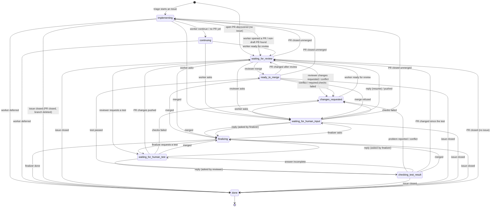
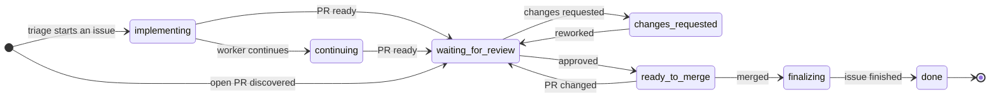
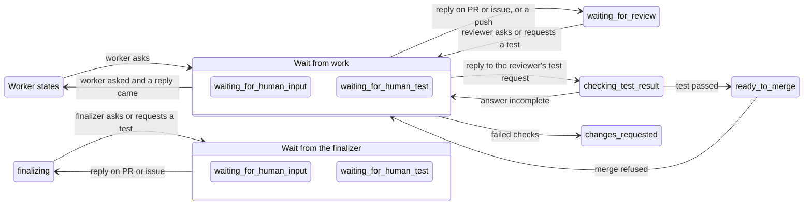
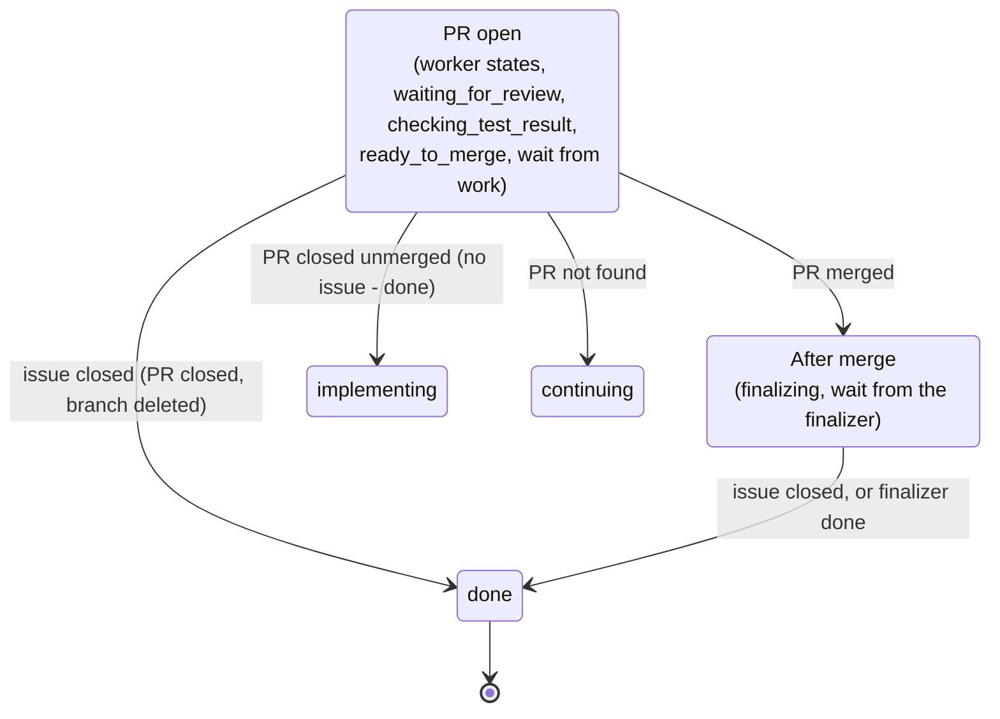

# Architecture: task state machine

This document is the specification of how a ghwatch task moves between states. It is the
reference for checking the code against, and for reasoning about the state machine itself.

**Status:** this is the target agreed on 2026-10-07. The code does not implement all of it
yet; [Differences from the current code](#differences-from-the-current-code) lists what is
still missing. When code and document disagree, decide which is wrong and fix one of them.

## Principles

- **One place decides transitions.** Actions (worker, reviewer, finalizer) return a
  decision; only the state machine changes `task.state`. Every combination of state and
  event below has a defined outcome.
- **Agents run when their basis changes, not when time passes.** Each decision records
  what it was based on (PR head, checks, comments, human replies). An agent runs again
  only when that basis has changed, or when a retry after a failure is due. The poll
  timer exists to look at GitHub, which is cheap, not to rerun agents.
- **Leaving a state cleans up after it.** Leaving a human wait always clears its marker,
  conversation and resume state, whatever the reason for leaving.
- **Every decision and transition is logged.**

## States

| State | Meaning | What runs |
| --- | --- | --- |
| `implementing` | Started from an issue; no PR yet | worker |
| `continuing` | The worker is continuing its work | worker |
| `changes_requested` | Reworking after review, a conflict or failed checks | worker |
| `waiting_for_review` | Waiting for review | reviewer (and deep reviewer) |
| `checking_test_result` | A person answered the reviewer's test request | test judge |
| `ready_to_merge` | Approved; waiting for checks and the merge | merge step |
| `waiting_for_human_input` | Waiting for a person's reply | nothing |
| `waiting_for_human_test` | Waiting for a person's test result | nothing |
| `finalizing` | Merged; finishing the issue | finalizer |
| `done` | Finished | nothing |

"Worker states" are `implementing`, `continuing` and `changes_requested`. A human wait is
"from work" when the worker or reviewer asked (resume state is a worker or review state),
and "from the finalizer" when the finalizer asked (resume state is `finalizing`).

## Diagrams

### Overall

Every transition in one picture; dense, but useful for checking that nothing is missing.

The diagrams show the paths; the tables below are complete and take precedence.

### Main path

The usual course of an issue, without waits or exceptions.

### Human waits

Where a task starts waiting for a person and what ends the wait. A wait from work and a
wait from the finalizer use the same two states, told apart by their resume state.

### Outside events

Events that apply to whole groups of states. Each box stands for the states listed in it.

## Transitions

The tables below are generated from `lib/ghwatch/state_machine.rb` (`rake docs`), the
single place that changes a task's state; a test fails when they drift apart. Actions
report a result, the engine reports events it observed on GitHub, and each row says what
happens next. "Run now" makes the task due immediately; "retry after `retry_after`"
schedules the next attempt.

Every action reports exactly one result; a result without a row is an error. Events are
evaluated on every poll and before every action, in the row order of the reactions table;
the first one with a rule for the task's group is applied.

<!-- BEGIN GENERATED: rake docs -->
### Results

**worker**

| Result | Next state and effects | Notes |
| --- | --- | --- |
| `waiting_for_review` | `waiting_for_review`; forget the last review; run now; triage again | Human testing is the reviewer's decision; an older `waiting_for_human_test` result is treated alike |
| `waiting_for_human_input` | `waiting_for_human_input`; resumes the current state; start waiting |  |
| `continue` | `continuing` (after 3 in a row: ask a person, resuming `continuing`); count a `continue`; retry after `retry_after` |  |
| `done` | `waiting_for_review`; run now | The PR is open |
| `merged` | `finalizing` (no issue: `done`); run now | `done` reported and the PR is already merged |
| `deferred` | `done`; remove worktrees; triage again | The issue's assessment becomes `deferred` |
| `no_pr` | `continuing`; retry after `retry_after` | Ready or done reported, but no PR exists |
| `no_change` | unchanged; retry after `retry_after` | `continue` without any change to the repository or the PR |
| `failed` | unchanged; retry after `retry_after` |  |

**reviewer**

| Result | Next state and effects | Notes |
| --- | --- | --- |
| `branch_updated` | unchanged; run now | The PR was behind its base and was updated; review the new head |
| `merge` | `ready_to_merge`; run now | Approved; with `auto_merge` off a person merges |
| `changes_requested` | `changes_requested` (after 3 rounds: ask a person, resuming `changes_requested`); rework: the latest review; count a rework round; run now |  |
| `waiting_for_human_input` | `waiting_for_human_input`; resumes `waiting_for_review`; start waiting |  |
| `waiting_for_human_test` | `waiting_for_human_test`; resumes `checking_test_result`; start waiting |  |
| `comment` | unchanged; retry after `retry_after` | Non-blocking; the same head is not reviewed again until something changes |
| `retry` | unchanged; retry after `retry_after` |  |
| `already_reviewed` | unchanged; retry after `retry_after` | Nothing changed since the last review of this head |
| `pr_changed` | unchanged; retry after `retry_after` | The PR changed during the review |
| `failed` | unchanged; retry after `retry_after` |  |

**test_judge**

| Result | Next state and effects | Notes |
| --- | --- | --- |
| `passed` | `ready_to_merge`; run now | Everything asked was confirmed, or a maintainer accepted it |
| `problem` | `changes_requested` (after 3 rounds: ask a person, resuming `changes_requested`); rework: the latest review; count a rework round; run now | The answer reports that the problem remains |
| `incomplete` | `waiting_for_human_test`; resumes `checking_test_result`; start waiting | Part of the request is unanswered; ask for that part only |
| `pr_changed` | `waiting_for_review`; run now | The head is not the one the person tested; ghwatch checks this before the judge runs |
| `retry` | unchanged; retry after `retry_after` |  |
| `failed` | unchanged; retry after `retry_after` |  |

**merge**

| Result | Next state and effects | Notes |
| --- | --- | --- |
| `pr_changed` | `waiting_for_review`; run now | The PR changed after the review |
| `pending` | unchanged; retry after `retry_after` | Checks still running, or GitHub has not computed mergeability |
| `manual` | unchanged; retry after `retry_after` | `auto_merge` is off; wait for a person to merge |
| `refused` | `waiting_for_human_input`; resumes `waiting_for_review`; start waiting | GitHub refused the merge; ask on the PR with the reason |
| `merged` | `finalizing` (no issue: `done`); remove the review workspace; triage again; run now |  |

**finalizer**

| Result | Next state and effects | Notes |
| --- | --- | --- |
| `not_merged` | `waiting_for_review` (no PR: `continuing`); retry after `retry_after` | The PR is not merged after all |
| `no_issue` | `done`; remove worktrees | A task without an issue has nothing to finish |
| `done` | `done`; remove worktrees; triage again |  |
| `waiting_for_human_input` | `waiting_for_human_input`; resumes `finalizing`; start waiting |  |
| `waiting_for_human_test` | `waiting_for_human_test`; resumes `finalizing`; start waiting |  |
| `retry` | unchanged; retry after `retry_after` |  |
| `failed` | unchanged; retry after `retry_after` |  |

### Reactions

| Event | Worker states | `waiting_for_review` | `checking_test_result` | `ready_to_merge` | Wait (work) | Wait (finalizer) | `finalizing` |
| --- | --- | --- | --- | --- | --- | --- | --- |
| PR merged | `finalizing` (no issue: `done`); clear the wait; reset the rework and `continue` counts; remove the review workspace; run now | `finalizing` (no issue: `done`); clear the wait; reset the rework and `continue` counts; remove the review workspace; run now | `finalizing` (no issue: `done`); clear the wait; reset the rework and `continue` counts; remove the review workspace; run now | `finalizing` (no issue: `done`); clear the wait; reset the rework and `continue` counts; remove the review workspace; run now | `finalizing` (no issue: `done`); clear the wait; reset the rework and `continue` counts; remove the review workspace; run now | — | — |
| Issue closed by someone (tasks ghwatch started) | `done`; clear the wait; close the PR, delete the branch and worktrees | `done`; clear the wait; close the PR, delete the branch and worktrees | `done`; clear the wait; close the PR, delete the branch and worktrees | `done`; clear the wait; close the PR, delete the branch and worktrees | `done`; clear the wait; close the PR, delete the branch and worktrees | `done`; clear the wait; remove worktrees | `done`; clear the wait; remove worktrees |
| PR closed unmerged | `implementing` (no issue: `done`); clear the wait; reset the rework and `continue` counts; forget the PR (tasks with an issue); remove the review workspace; run now | `implementing` (no issue: `done`); clear the wait; reset the rework and `continue` counts; forget the PR (tasks with an issue); remove the review workspace; run now | `implementing` (no issue: `done`); clear the wait; reset the rework and `continue` counts; forget the PR (tasks with an issue); remove the review workspace; run now | `implementing` (no issue: `done`); clear the wait; reset the rework and `continue` counts; forget the PR (tasks with an issue); remove the review workspace; run now | `implementing` (no issue: `done`); clear the wait; reset the rework and `continue` counts; forget the PR (tasks with an issue); remove the review workspace; run now | — | — |
| PR not found | — | `continuing` (no issue: unchanged); retry after `retry_after` | `continuing` (no issue: unchanged); retry after `retry_after` | `continuing` (no issue: unchanged); retry after `retry_after` | `continuing` (no issue: unchanged); clear the wait; retry after `retry_after` | — | `continuing` (no issue: unchanged); retry after `retry_after` |
| PR found | `waiting_for_review` (draft: unchanged); record the PR; run now | — | — | — | unchanged; record the PR | — | — |
| Conflict with the base | unchanged; run now; only when newly observed | `changes_requested`; rework: conflict; forget the last review; run now | `changes_requested`; rework: conflict; forget the last review; run now | `changes_requested`; rework: conflict; forget the last review; run now | — | — | — |
| Required checks failed | unchanged; run now; only when newly observed | — | — | `changes_requested` (after 3 rounds: ask a person, resuming `changes_requested`); rework: failed checks; count a rework round; forget the last review; run now; once per PR head | `changes_requested` (after 3 rounds: ask a person, resuming `changes_requested`); clear the wait; rework: failed checks; count a rework round; forget the last review; run now; once per PR head | — | — |
| Someone pushed to the PR | unchanged; run now | unchanged; run now | `waiting_for_review`; run now; unless only the base was merged in | `waiting_for_review`; run now | `waiting_for_review`; clear the wait; run now; unless only the base was merged in | — | — |
| A person replied after the question (PR or issue) | — | — | — | — | the interrupted state; clear the wait; reset the rework and `continue` counts; give the answer to the next runs; run now | the interrupted state; clear the wait; reset the rework and `continue` counts; give the answer to the next runs; run now | — |
| New comment or review by a person | unchanged; run now | unchanged; run now | — | `waiting_for_review`; run now | — | — | — |
<!-- END GENERATED -->

### Notes on reactions

- A merge comes before the issue closing: merging a PR that says "Fixes #N" closes the
  issue in the same moment, and that is not a reason to abandon the work. After the
  merge (`finalizing` and the finalizer's waits), closing the issue counts only when it
  happened after the task got there.
- "Issue closed" applies only to tasks ghwatch started from an issue, never to an external
  PR that merely links one.
- A push or a comment is reported once: what was seen is recorded after every poll and
  every action, so the task's own work is not news. After an action the last comment seen
  stays where it was when the agent started: a person's comment posted while it ran is
  still news. "Only when newly observed" applies the same to a conflict or failed checks
  that are still there.
- A reply is any comment without a ghwatch marker posted after the question, on the PR or
  the issue, or posted while the agent that asked was running, since it never saw it. No
  agent of that task runs during the wait, so such comments are a person's.
- A conflict does not end a human wait: the question stands until a person answers, and
  the conflict is resolved when the work resumes. Nothing merges while a task waits, and
  merging the base does not undo a person's check.
- An answer to the reviewer's test request is judged, not reviewed: the PR the person
  tested was already reviewed, so `checking_test_result` runs only the test judge, which
  needs no workspace or build, and the PR is not updated from its base first. A PR whose
  changes differ from the tested head (recorded when the request was made) goes back to
  review instead. A test the finalizer requested resumes `finalizing` as before.
- A push that only merged the base in ("Update branch") does not end a wait or the check
  of a test result: the PR's changes are those a person was asked about. ghwatch compares
  the patch id of each head's diff from its fork point; any other edit, a base change next
  to the PR's own lines, or a head it cannot compare counts as a change.
- Reaching the rework limit asks a person with the reason of this round (the latest
  review, the conflict or the failed checks), not an older one.
- `waiting_for_review` also counts a change in the PR's checks as activity, so a review
  that waited for CI runs again when it finishes; the merge step looks at checks itself.
- Time alone does nothing. Results schedule retries; a `waiting_for_review` task with
  nothing scheduled is given a retry, and the reviewer skips a head it already reviewed.
  Human waits have no deadline and no reminder.
- Agent failures try the role's fallback models first (see README), then report `failed`.

## Scheduling

ghwatch runs one agent at a time. Work that needs no agent (looking at GitHub and
reacting, attempting a merge, syncing labels) is done for every task on every poll. Agent
work is chosen again before every single action (`TaskEngine#run_due`):

1. Look at every task again if the last look is over a minute old.
2. Among the tasks that can run now, take the oldest, whatever work it needs (review,
   rework, implementation, finalizing). Age is the number of the issue the task came from,
   or the PR's number for an external PR; GitHub numbers both in one sequence.
3. Run one action for it, then start over.

So older work is finished before newer work is touched, and a reply or push on an older
task is picked up after the current action instead of after a whole round of others.
A task runs at most 6 actions in one call; after that it waits for the next poll. Triage,
which starts new issues, runs on its own schedule between these rounds.

Two limits stop a task that does not converge from taking all the agent time; both ask a
person instead (on the PR, or the issue without one), and both counts are reset when they
reply, and when the PR merges or closes:

- Rework rounds: a PR may go back to the worker `REWORK_LIMIT` (3) times for review changes
  or failed checks. Conflicts do not count; they come from other PRs merging first.
- `continue`: a worker may report it `CONTINUE_LIMIT` (3) times in a row.

Known limits: what happens while an agent runs (up to its timeout) is looked at only after
it finishes, and newer work waits while older work is ready.

## Differences from the current code

Updated with the state machine (stage 1). Remove entries as they are implemented.

| # | Gap | Status |
| --- | --- | --- |
| 3 | Human waits have no deadline | Unchanged by decision |
| 11 | Reviews of an unchanged basis are skipped only after `comment`; other results rely on their own transitions | Stage 2: one recorded basis per decision, agents run only when it changes |
| 13 | Each decision's basis is spread over ad hoc metadata (`commented_review`, `failed_checks_head`, `branch_updated_from`, `observed`, ...) | Stage 2 |
| 14 | No history of decisions and transitions beyond the log | Stage 3: `task_events` table and `ghwatch log` |
